University: [ITMO University](https://itmo.ru/ru/)  
Faculty: [FICT](https://fict.itmo.ru)  
Course: [Введение в веб технологии](https://itmo-ict-faculty.github.io/introduction-in-web-tech/)  
Year: 2025/2026  
Group: K66666  
Author: Lastovskaia Anna Alexandrovna  
Lab: Lab1  
Date of create: 15.03.2026  
Date of finished: 16.03.2026    
## Подготовка
Мне понадобилось обновить систему на личном ноутбуке для выполнения этой лабы.  Мой ноут имеет долгую историю приключений, в том числе кражу, после которой мне досталась ломаная винда. Дольше занималась апдейтом, чем лабами, если честно.  
Понятная штатная ситуация в любом проекте, но интересно, как с ней справляются люди без опыта работы в айти среде.
## Выполнение лабы
* Изучение команд    
  ` docker run hello-world `   
  Запускает контейнер, судя по описанию - специально созданный для пробного запуска:  
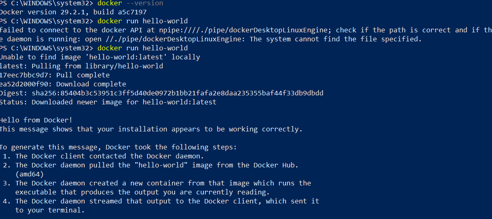    
  ` docker images ` отдает список локальных (скачанных из репозитория) образов        
  ` docker ps ` список запущенных контейнеров (сейчас пусто, потому что hello world останавливается после выполнения)    
  ` docker ps -a `  или -all, история запуска контейнеров  
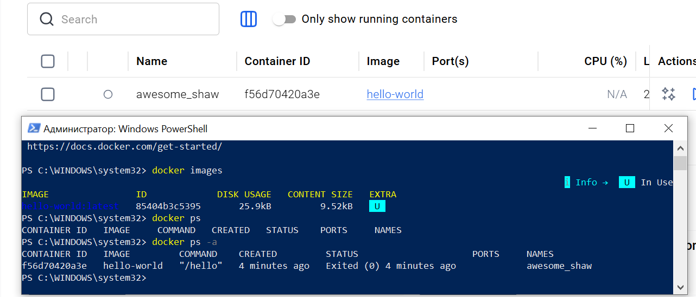    
* Работа с образами    
  ```
  docker pull ubuntu:latest
  docker run -it ubuntu bash
  apt update && apt install -y curl
  curl --version
  exit
  ```    
Скачался образ ubuntu, пронаблюдала, какую нагрзку показывал Docker Desktop за время установки curl. Container CPU usage поднялся до 100% из 800%. Exit остановил работу контейнера.  
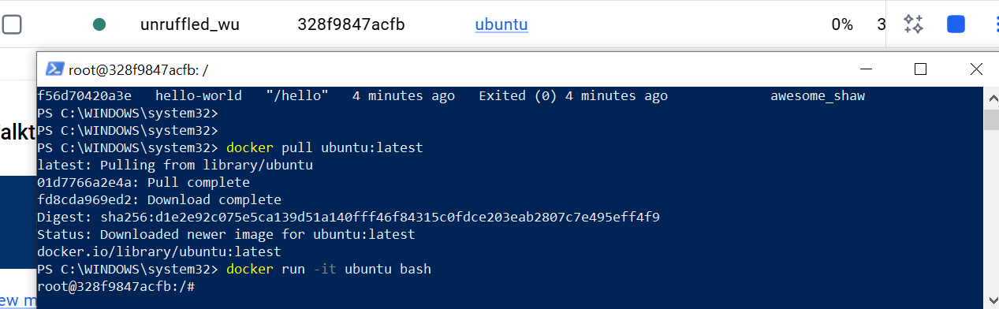    
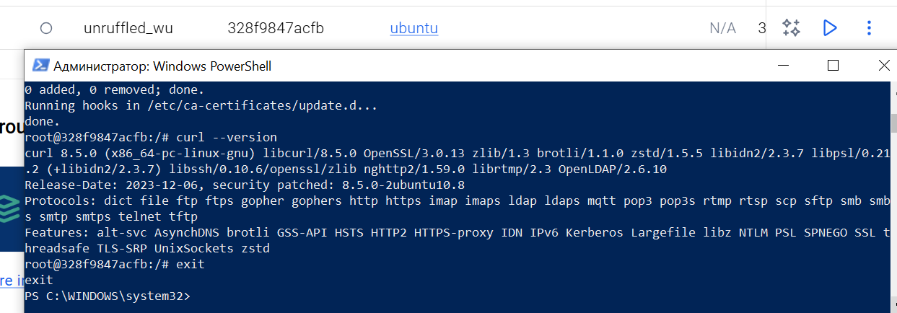     
* Запуск веб-сервера
   ```
   docker run -d -p 8080:80 --name web-server nginx:alpine
   http://localhost:8080
   docker logs web-server
   docker exec -it web-server sh
    ```
При запуске контейнера веб сервера выскочило оповещение безопасности Windows, дала доступ для Docker Desktop Backend связь в частных и общественных сетях.  
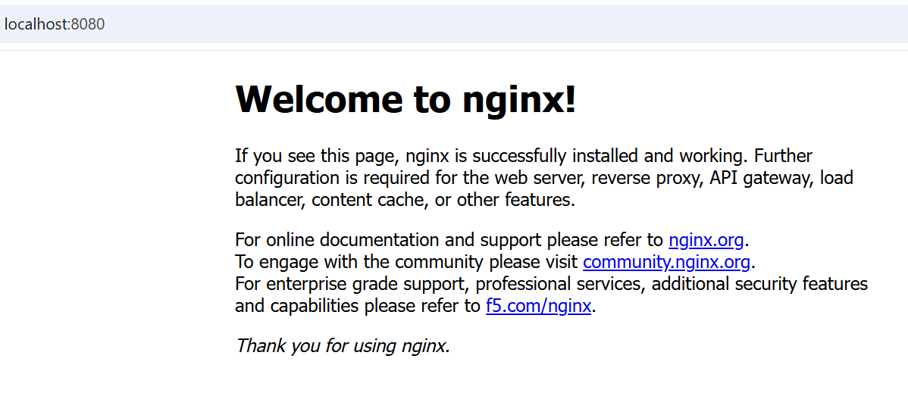  
Подключилась к серверу с разных браузеров, наверное в логах об этом и речь (несколько GET).   
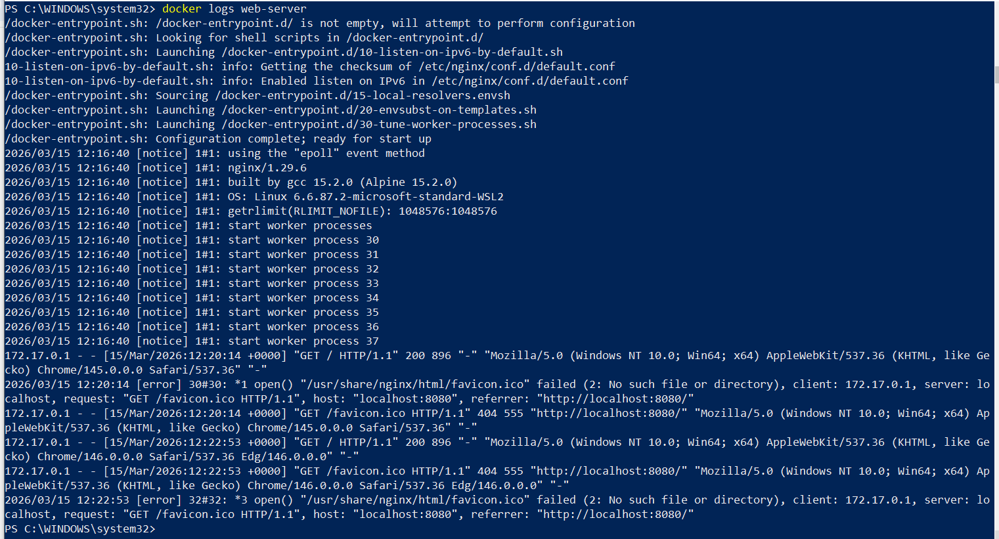    
Подключилась к запущенному контейнеру через PS, выполнила несколько комманд и вышла (контейнер остался активным):  
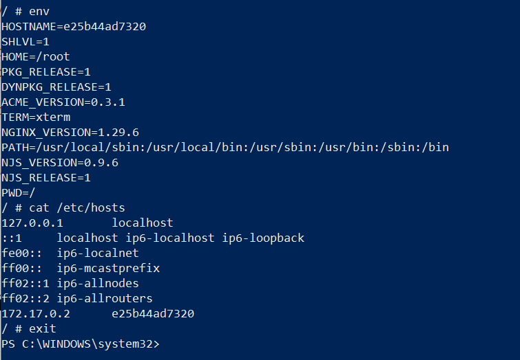      

* Управление контейнерами
 ```
 docker stop web-server
 docker start web-server
 docker rm web-server
 docker rmi nginx:alpine
 ```
Проверила, что образ невозможно удалить, пока есть работающий с ним контейнер.   
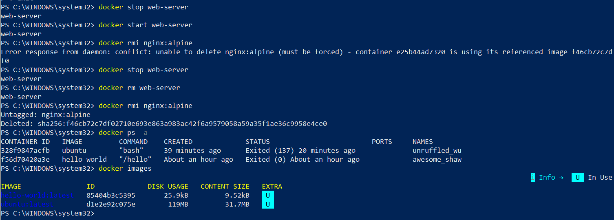  
* Работа с томами
 ```
 docker volume create my-volume
 docker run -it --name volume-test -d -v my-volume:/data ubuntu bash
 docker exec -it volume-test bash
 echo "Hello from volume" > /data/test.txt
 ```
Проследила, что во вкладке Volumes был создан my-volume. При запуске контейнера volume-test в клиенте появился новый контейнер и статус тома сменился на in use (зеленая точка).  
Убедилась, что удаление контейнера не затрагивает том. 
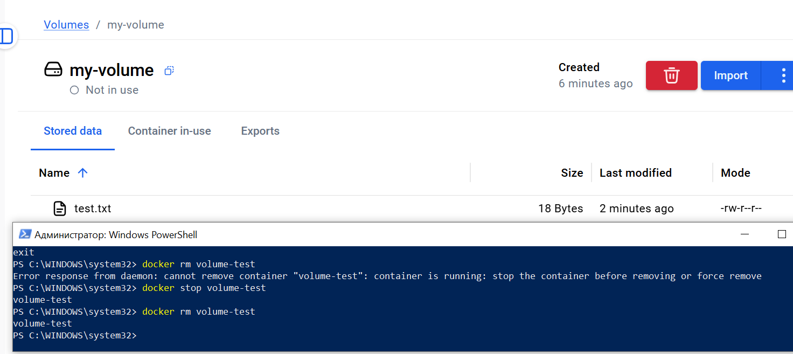    
Подключение нового контейнера к тому же тому возможно, сохраненный ранее файл при этом остается в томе. 
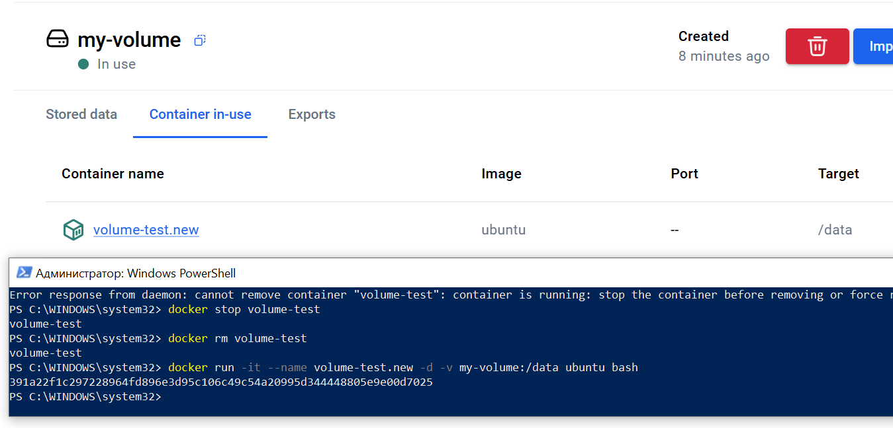    
## Выполнила ⭐ для следующей лабы  
Работала в репозитории `https://github.com/lastovich/devops-lab-lastovskaia.git`. Создалы файлы по описанию, первая сборка прошла, но контейнер не поднялся. Пришлось включить внутреннего траблшутера и GPT.    
Совместными усилиями выяснили, что произошел конфликт библиотек, старый Flask (микрофреймворк для создания веб-приложений на Python), но новый Werkzeug (библиотека, служащая основой для Flask, которая обрабатывает HTTP-запросы, маршрутизацию и отладку).  
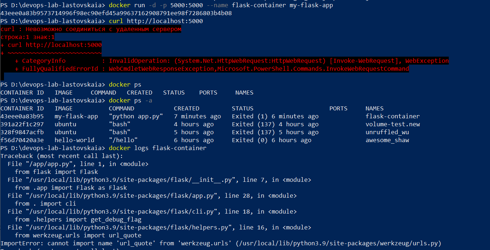  
Чтобы починить эту проблему, зафиксировала версию библиотеки в requirements.txt:
```
Flask==2.0.3
Werkzeug==2.0.3
```    
Новая сборка оказалась успешной:  
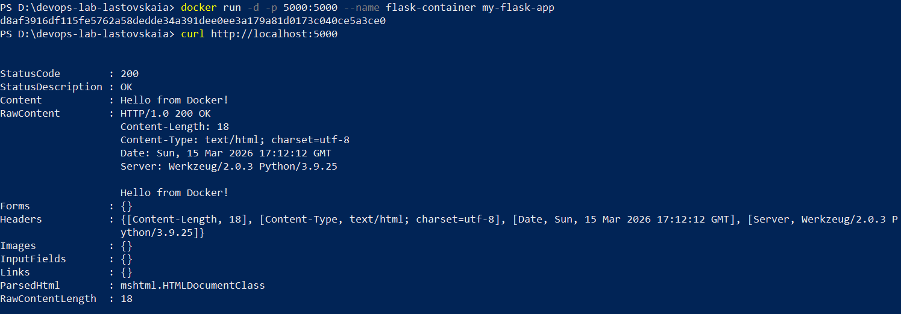  
