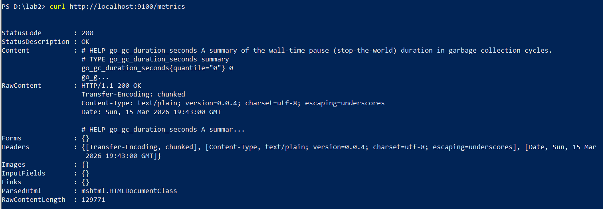
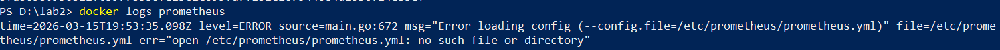
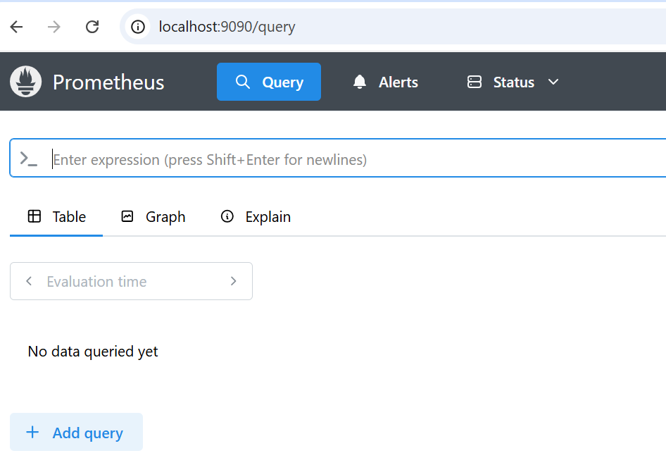

University: [ITMO University](https://itmo.ru/ru/)  
Faculty: [FICT](https://fict.itmo.ru)  
Course: [Введение в веб технологии](https://itmo-ict-faculty.github.io/introduction-in-web-tech/)  
Year: 2025/2026    
Group: U4125
Author: Lastovskaia Anna Alexandrovna
Lab: Lab3
Date of create: 15.03.2026
Date of finished: 16.03.2026
## Подготовка
Решила не создавать новый репозиторий, отключила CI, изменив имя `docker-build.yml.disabled`.  
## Выполнение  
* Node Exporter
Создала `prometheus/prometheus.yml`, который будет собирать метрики с `targets: ['node-exporter:9100']` каждые 15 секунд.  
Сделала pull с веб репозитория в локальный и запустила Node Exporter (контейнер, который собирает системные метрики (CPU, память, диски)

* Prometheus
Пришлось проверять логи, чтобы выяснить, поему не может запуститься контейнер. 

Прописала полный путь `"${PWD}\prometheus:/etc/prometheus"`, удалила контейнер вручную и перезапустила команду:

* Graphana
Успешно запущена на порту 3000.  Data Sources находятся под Connections, не Configuration.
## Troubles
В попытках построить красивые графики перешла в веб интерфейс Prometheus, данные не собираются, хотя Node Exporter жив.
😢 Оказывается , что для сбора метрик с Windows OS необходимо было поднять Windows Exporter, он бы сработал как target для Prometheus, и показал бы мне красивые графики.
🏳️
